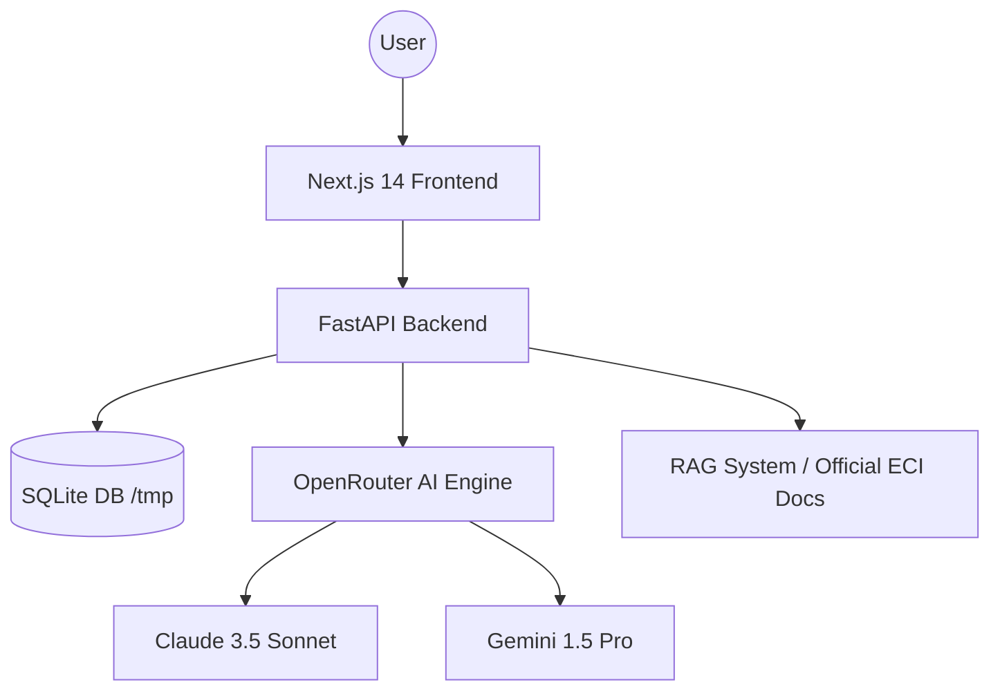

# 🇮🇳 VoteSmart India — AI-Powered Electoral Guide

[](https://opensource.org/licenses/MIT)
[](https://nextjs.org/)
[](https://fastapi.tiangolo.com/)
[](https://openrouter.ai/)

**VoteSmart India** is a premium, AI-driven platform designed to empower Indian citizens with accurate, official, and accessible electoral information. It combines real-time AI assistance with verified ECI data to combat misinformation and promote civic awareness.

### 🚀 **Live Demo**: [votesmart-web-99378412040.europe-west1.run.app](https://votesmart-web-99378412040.europe-west1.run.app)

---

## 📸 Screenshots

| Homepage | AI Chat Assistant |
| :---: | :---: |
|  |  |

| Fact-Check Engine | Civic Quiz |
| :---: | :---: |
|  |  |

---

## 🌟 Key Features

- **🤖 AI Electoral Assistant**: Context-aware chat grounded in official ECI guidelines with bilingual support (English/Hindi).
- **🔍 Verified Fact-Checker**: Instant verification of viral claims using a dedicated election misinformation database.
- **🗺️ Booth Finder**: Real-time constituency and polling station search with mock data for demonstrations.
- **📅 Election Timeline**: Interactive roadmap of the polling phases and results.
- **🎓 Civic Quiz**: Engaging proficiency tests to educate voters on their rights and the voting process.

---

## 🏗️ Architecture



### Tech Stack
- **Frontend**: Next.js 14 (App Router), Tailwind CSS v4, Framer Motion.
- **Backend**: FastAPI (Python 3.12), SQLAlchemy (Async).
- **Database**: SQLite (Ephemeral for Cloud Run).
- **Deployment**: Google Cloud Run (Containerized).

---

## 🚀 Getting Started

### 1. Clone & Setup
```bash
git clone https://github.com/Nitinkgupta9967/Prompt_War.git
cd Prompt_War
```

### 2. Backend Setup
```bash
cd backend
python -m venv .venv
source .venv/bin/activate  # On Windows: .venv\Scripts\activate
pip install -r requirements.txt
uvicorn main:app --reload
```

### 3. Frontend Setup
```bash
cd ../frontend
npm install
npm run dev
```

---

## 📜 License
Distributed under the MIT License. See `LICENSE` for more information.

---
*Disclaimer: This platform is for educational and awareness purposes. Always verify official details at [voters.eci.gov.in](https://voters.eci.gov.in).*
